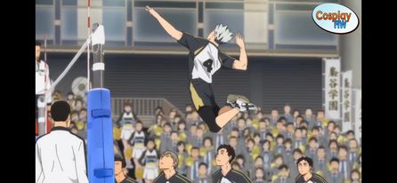
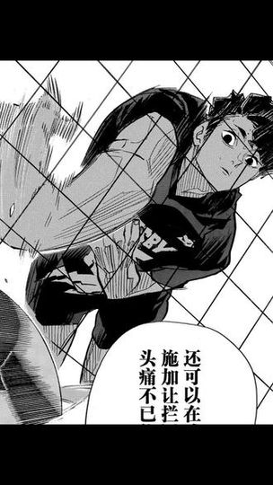
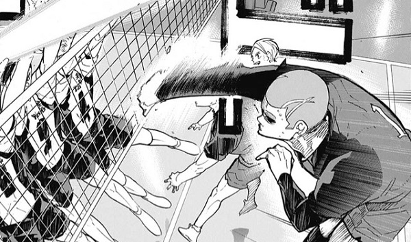

<body>

<h1>木兔光太郎</h1>

職位:隊長

<button type="button" onclick="document.querySelector('#demo').innerHTML = '大砲手'">位子</button>

一球入魂

<button type="button" onclick="document.getElementById('demb').style.display='block'">球隊標語</button>

梟谷學園王牌，是全國名列前五名的大砲手，當進入狀況時其實力可以凌駕在三大王牌之上。他常常會因為一些小事情而心情低落，只要心情低落的他實力會大幅下降，像是曾因為在小球館打球而沮喪，其招牌是小斜線，由於其背肌強大，可以往身體外側揮擊球，其球線十分刁鑽，非常難防。

<h1>牛島若利</h1>

獅子奮迅

<button type="button" onclick="document.getElementById('dema').style.display='block'">球隊標語</button>

	白鳥澤王牌，是全國三大王牌之一，因為左撇子擁有獨特的旋轉讓許多接球高手感到頭痛，加上白鳥澤的戰術安排常常讓他打滿整場，所以牛島的體力很好，其招牌是左撇子扣球旋轉加上力道，讓平常接習慣右手扣球的人很難習慣牛島的球，加上排球是一瞬間的事情，一點遲疑就接不好球了。

<h1>佐久早聖臣</h1>

努力

<button type="button" onclick="document.getElementById('demc').style.display='block'">球隊標語</button>

井闥山王牌，因為小時候性格孤僻，所以其堂哥帶聖臣打球，由於天生擁有柔軟的手腕，所以可以在球上加入更多旋轉，其難接程度彷彿拿桌球拍去接旋球，聖臣有潔癖，會戴口罩和使用手帕，並且會討厭常生病的人，主角之後當他隊友還一句話都不跟他講(主角曾經在大賽中病倒)，其招牌是利用手腕加在球上的旋轉，導致打出去的球會很難接，漫畫有畫出聖臣熱身時的樣貌，會將手腕折到底碰到前臂，十分噁心。

<h1>桐生八</h1>

狢坂高中王牌，人稱"扣惡球的桐生"，和牛島.佐久早三人稱為全國三大王牌，因為在國中沒辦法在隊友舉不好的情況下扣去好球，身為球隊王牌的他十分難過，在那天就暗暗發誓，不管隊友舉什麼球過來，都要給他狠狠地扣下去，惡球指的是攻擊手不好處理的球，桐生的招牌是大力扣球，而且是不管怎樣的球都可以大力扣，不管是沒距離助跑或是球非常低導致要原地跳，桐生都可以扣出力道驚人的球。

</body>
